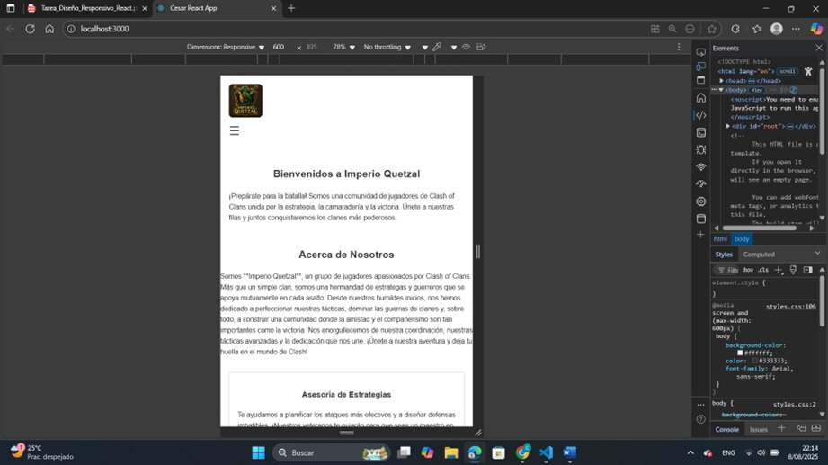
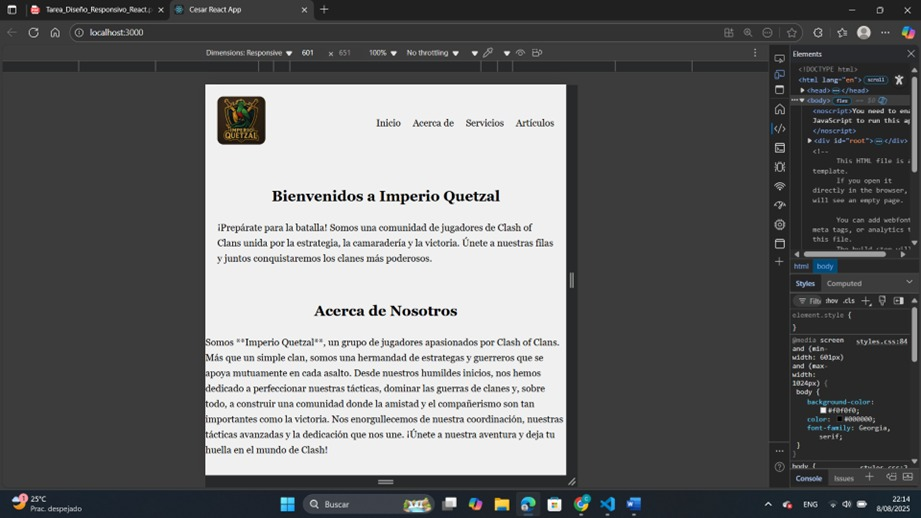
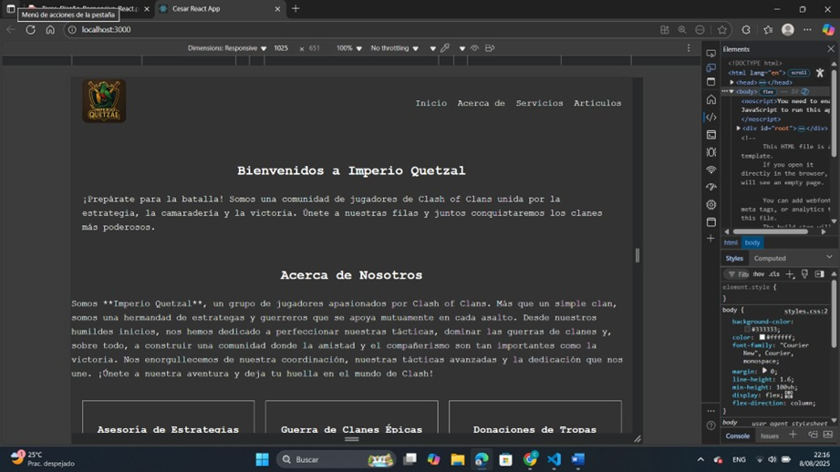

# Tarea: Diseño Responsivo en React con TypeScript

### Descripción del Enfoque

Este proyecto es una aplicación web responsiva construida con **React** y **TypeScript**. Para el diseño responsivo, se utilizó **CSS nativo y Media Queries personalizadas**, permitiendo que la interfaz se adapte a diferentes tamaños de pantalla sin usar un framework de estilos.

La aplicación está dedicada al clan de Clash of Clans **"Imperio Quetzal"** y su contenido se ajusta de la siguiente manera:

- **Móviles (≤600px):** El menú de navegación se convierte en un menú hamburguesa y las tarjetas de contenido se apilan en una columna.
- **Tabletas (601px - 1024px):** Las tarjetas se organizan en dos columnas.
- **Escritorio (>1024px):** Las tarjetas se muestran en tres columnas.

### Vistas del Diseño Responsivo

Aquí están las capturas de pantalla que demuestran la adaptabilidad del diseño:

**Vista Móvil**

**Vista de Tableta**

**Vista de Escritorio**

### Enlace al Despliegue

Puedes ver la aplicación en vivo en el siguiente enlace:
[Ver la aplicación desplegada](https://responsivo-cesar-4l6g9meiu-cugc142s-projects.vercel.app/)

---
*Proyecto desarrollado para la tarea de implementación de diseño responsivo.*